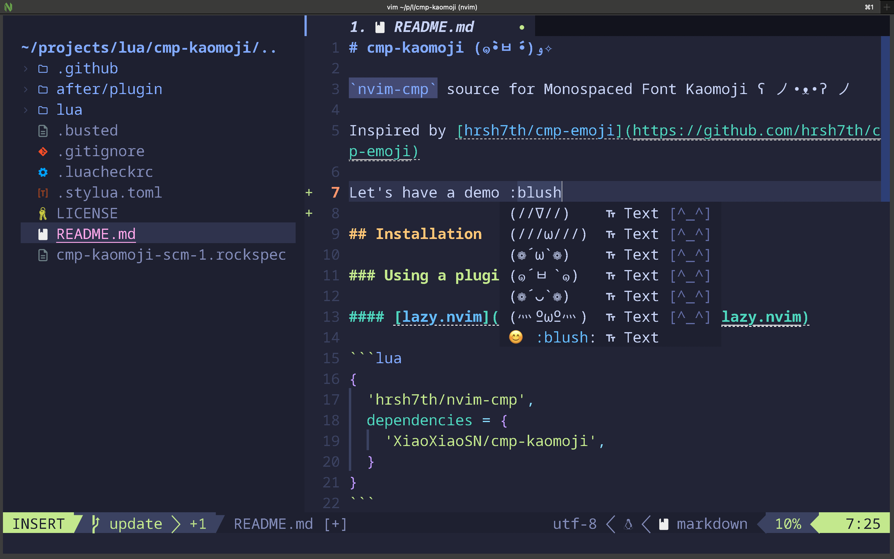

# cmp-kaomoji (๑•̀ㅂ•́)و✧

`nvim-cmp` source for Monospaced Font Kaomoji ʕ ノ•ᴥ•ʔ ノ

Inspired by [hrsh7th/cmp-emoji](https://github.com/hrsh7th/cmp-emoji)



## Installation

### Using a plugin manager

#### [lazy.nvim](https://github.com/folke/lazy.nvim)

```lua
{
  'hrsh7th/nvim-cmp',
  dependencies = {
    'XiaoXiaoSN/cmp-kaomoji',
  }
}
```

#### [packer.nvim](https://github.com/wbthomason/packer.nvim)

```lua
use {
  'hrsh7th/nvim-cmp',
  requires = {
    'XiaoXiaoSN/cmp-kaomoji',
  }
}
```

## Setup

```lua
require'cmp'.setup {
  sources = {
    { name = 'kaomoji' }
  }
  -- Optional
  formatting = {
    format = require('lspkind').cmp_format({
      mode = 'symbol_text',
      menu = {
        kaomoji = '[^_^]',
      },
    })
  }
}
```

## Development

### Testing

Tests are written using the [busted](https://olivinelabs.com/busted/) framework. To run the tests:

```bash
# Using luarocks
luarocks test --local

# Or run directly with busted
busted
```

## References

Thanks [jsingason/kaokun](https://github.com/jsingason/kaokun) for the kaomoji collection.
